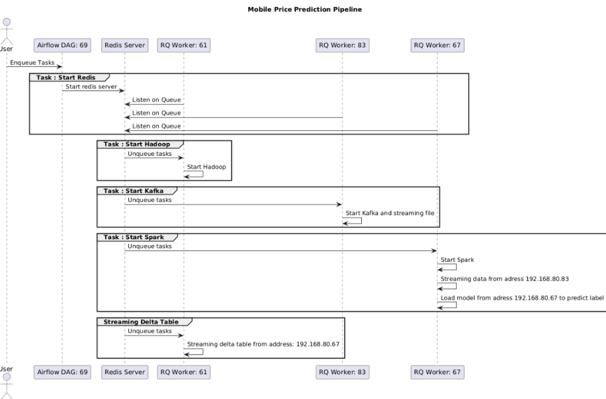

<!-- PROJECT LOGO -->
<br />
<div align="center">
  <h3 align="center">Big Data</h3>
  <p align="center">
    Mobile Price Prediction and Streaming Project <br />
    <a href="https://www.canva.com/design/DAGLKbMhFtY/SZyxvommJOsJmA8BRyAQUg/edit"><strong>Explore the slides »</strong></a>
    <br />
    <br />
  </p>
</div>

<!-- TABLE OF CONTENTS -->
<details>
  <summary>Table of Contents</summary>
  <ol>
    <li><a href="#about-the-project">About The Project</a></li>
    <li>
      <a href="#getting-started">Getting Started</a>
      <ul>
        <li><a href="#prerequisites">Prerequisites</a></li>
        <li><a href="#installation">Installation</a></li>
      </ul>
    </li>
    <li><a href="#usage">Usage</a></li>
    <li><a href="#contributing">Contributing</a></li>
    <li><a href="#contact">Contact</a></li>
  </ol>
</details>

<!-- ABOUT THE PROJECT -->
## About The Project

This project implements a mobile price prediction pipeline using Apache Spark, Kafka, and Delta Lake. The pipeline involves data ingestion, real-time data processing, model storage, and orchestration with Airflow and Redis Queue.

### UML Diagram


*Note: Worker "69" means that the task is executed at address 192.168.80.69 and so on.*

### Components

#### Data Ingestion

- **CSV File**: Contains the data for training, evaluating, and streaming. We save it to HDFS for easy access.
- **Kafka Producer**: Reads data from the CSV file and sends it to a Kafka topic.
- **Kafka Topic**: Receives data from the Kafka producer.

#### Model Storage

- **Hadoop**: Storage system for the trained model.
- **Logistic Regression Model**: Trained model stored in Hadoop.

#### Real-Time Data Processing

- **Spark Streaming**: Reads data from Kafka, applies the model, and produces predictions.
- **Logistic Regression Model**: Used for predictions.
- **HDFS**: Storage for the model and predictions.

#### Reading Delta Table

- **Delta Table in HDFS**: Stores the predictions.
- **Spark DataFrame**: Loads data from the Delta table for further processing.

#### Orchestration

- **Airflow DAG**: Manages the execution of tasks.
- **Redis Queue**: Manages the queue of tasks to be executed.
- **Tasks**: Include starting Redis, Hadoop, Spark, Kafka, and reading the Delta table.

#### Task Execution

- **RQ Worker**: Listens on the Redis queue and executes tasks.

### Workflow

1. **Start Redis**: Airflow DAG enqueues the task to start Redis.
2. **Start Hadoop**: Redis server enqueues the task to start Hadoop, executed by RQ Worker.
3. **Start Spark**: Enqueues the tasks to start Spark and execute relevant tasks, including loading the model from HDFS and streaming and reading data before prediction. Also reads predictions to the Delta table.
4. **Start Kafka**: Enqueues and starts Kafka and streams the data file.
5. **Read Delta**: Reads the Delta table from HDFS.

## Scripts

To ensure uninterrupted execution, the files from each folder in the repository need to be available on the machines where tasks are executed.

### Directory Structure

#### `redis/`
- **`start_hadoop.py`**: Enqueues a task to start Hadoop.
- **`start_kafka.py`**: Enqueues a task to start Kafka.
- **`start_spark.py`**: Enqueues a task to start Spark.
- **`read_delta.py`**: Enqueues a task to read from the Delta table.
- **`tasks.py`**: Contains definitions for various tasks, such as starting Kafka, Hadoop, Spark, and reading Delta.

#### `airflow/`
- **`mobileprice.py`**: Defines the Airflow DAG that orchestrates the workflow of starting services and running scripts.

#### `hadoop/`
- **`mobile_price.py`**: Contains the PySpark script for training a Logistic Regression model using data from HDFS.
- **`tasks.py`**: Includes a script for starting Hadoop services.
- **`test.csv`**: Sample data file for training and testing purposes.

#### `kafka/`
- **`mobile_price_streaming.py`**: Reads data from `test.csv` and sends data to the Kafka topic `mobile_price`.
- **`tasks.py`**: Starts Kafka and Zookeeper services using the command-line interface.

#### `spark/`
- **`load1.py`**: Reads streaming data from Kafka, applies a pre-trained Logistic Regression model, and writes predictions to the console and HDFS.
- **`tasks.py`**: Starts Spark services and submits the `load1.py` file using the command-line interface.

#### `delta/`
- **`readdelta_mobile_price.py`**: Reads streaming data from a Delta Lake table and writes the output to the console.
- **`tasks.py`**: Submits the `readdelta_mobile_price.py` file using the command-line interface.

<p align="right">(<a href="#readme-top">back to top</a>)</p>

### Built With

This section lists the major frameworks/libraries used to bootstrap your project.

* [![Apache Spark][Spark-logo]][Spark-url]
* [![Apache Kafka][Kafka-logo]][Kafka-url]
* [![Delta Lake][Delta-logo]][Delta-url]
* [![Hadoop][Hadoop-logo]][Hadoop-url]
* [![Airflow][Airflow-logo]][Airflow-url]
* [![Redis Queue][Redis-logo]][Redis-url]

<!-- Add your logos and URLs here -->
[Spark-logo]: https://img.shields.io/badge/Apache%20Spark-E25A1C?style=for-the-badge&logo=apachespark&logoColor=white
[Spark-url]: https://spark.apache.org/

[Kafka-logo]: https://img.shields.io/badge/Apache%20Kafka-231F20?style=for-the-badge&logo=apachekafka&logoColor=white
[Kafka-url]: https://kafka.apache.org/

[Delta-logo]: https://img.shields.io/badge/Delta%20Lake-00A3E0?style=for-the-badge&logo=deltalake&logoColor=white
[Delta-url]: https://delta.io/

[Hadoop-logo]: https://img.shields.io/badge/Hadoop-66CCFF?style=for-the-badge&logo=apachehadoop&logoColor=white
[Hadoop-url]: https://hadoop.apache.org/

[Airflow-logo]: https://img.shields.io/badge/Apache%20Airflow-017CEE?style=for-the-badge&logo=apacheairflow&logoColor=white
[Airflow-url]: https://airflow.apache.org/

[Redis-logo]: https://img.shields.io/badge/Redis%20Queue-DC382D?style=for-the-badge&logo=redis&logoColor=white
[Redis-url]: https://redis.io/topics/queues

<p align="right">(<a href="#readme-top">back to top</a>)</p>

<!-- GETTING STARTED -->
## Getting Started

This guide will help you get your project up and running locally. Follow these steps to set up your environment and run the project.

### Prerequisites

Ensure you have the following software installed on your machine:

* [Java](https://www.oracle.com/java/technologies/javase-downloads.html) (version 8 or higher)
* [Apache Spark](https://spark.apache.org/downloads.html)
* [Apache Kafka](https://kafka.apache.org/downloads)
* [Delta Lake](https://delta.io/downloads/)
* [Hadoop](https://hadoop.apache.org/releases.html)
* [Apache Airflow](https://airflow.apache.org/docs/apache-airflow/stable/installation.html)
* [Redis](https://redis.io/download)

### Installation

1. Clone the repository:
    ```sh
    git clone https://github.com/hophuoclanh/bigdata_final.git
    cd bigdata_final
    ```

2. Set up your environment:

    - **Apache Spark**:
        ```sh
        tar xvf spark-3.5.1-bin-hadoop3-scala2.13.tgz
        export SPARK_HOME=$(pwd)/spark-3.5.1-bin-hadoop3-scala2.13
        export PATH=$PATH:$SPARK_HOME/bin
        ```

    - **Apache Kafka**:
        ```sh
        tar -xzf kafka_2.13-2.8.0.tgz
        export KAFKA_HOME=$(pwd)/kafka_2.13-2.8.0
        export PATH=$PATH:$KAFKA_HOME/bin
        ```

    - **Hadoop**:
        ```sh
        tar -xzf hadoop-3.3.1.tar.gz
        export HADOOP_HOME=$(pwd)/hadoop-3.3.1
        export PATH=$PATH:$HADOOP_HOME/bin
        ```

    - **Apache Airflow**:
        ```sh
        pip install apache-airflow
        airflow db init
        airflow users create --username admin --firstname Admin --lastname User --role Admin --email admin@example.com
        ```

    - **Redis**:
        ```sh
        sudo apt-get update
        sudo apt-get install redis-server
        pip install rq
        ```

3. Start the services:
   Note: Services are managed directly by the Airflow orchestration.

<!-- Usage -->

### Usage
# Start Airflow in Standalone Mode
        airflow standalone
# Access the Web Interface
```http://localhost:8080```
Here, you can log in using the credentials you created in below and access the Airflow web interface to monitor and manage your workflows.

You can now create and test your DAGs. Place `yourmobileprice.py` file in the dags folder, which is typically located in the Airflow home directory (by default, ~/airflow/dags).
# Setup Redis Workers
On each computer that will act as a Redis worker, ensure that the following files are set up and executed:

        rq worker -u redis://192.168.80.69:6379/ 61 #run at computer with address 192.168.80.61
        
        rq worker -u redis://192.168.80.69:6379/ 67 #run at computer with address 192.168.80.67
        
        rq worker -u redis://192.168.80.69:6379/ 83 #run at computer with address 192.168.80.83
## Pipeline
1. **Start Services**:
   - Use `redis` tasks to enqueue and execute tasks for starting Hadoop, Kafka, and Spark.

2. **Stream Data**:
   - Run `mobile_price_streaming.py` in the `kafka/` directory to stream data to Kafka.

3. **Process Data**:
   - Execute `load1.py` in the `spark/` directory to read from Kafka, apply the model, and store results in HDFS.

4. **Read Processed Data**:
   - Run `readdelta_mobile_price.py` in the `delta/` directory to read and display data from Delta Lake.


<p align="right">(<a href="#readme-top">back to top</a>)</p


<!-- Contributing -->

### Contributing

Contributions are what make the open source community such an amazing place to learn, inspire, and create. Any contributions you make are **greatly appreciated**.

If you have a suggestion that would make this better, please fork the repo and create a pull request. You can also simply open an issue with the tag "enhancement".
Don't forget to give the project a star! Thanks again!

1. Fork the Project (`https://github.com/hophuoclanh/bigdata_final/fork`)
2. Create your Feature Branch (`git checkout -b feature/YourFeature`)
3. Commit your Changes (`git commit -m 'Add YourFeature'`)
4. Push to the Branch (`git push origin feature/YourFeature`)
5. Open a Pull Request

<p align="right">(<a href="#readme-top">back to top</a>)</p>


<!-- CONTACT -->
### Contact

Ho Phuoc Lanh -
Pham Tran Thi Thu Ngan  

Project Link: [https://github.com/hophuoclanh/bigdata_final](https://github.com/hophuoclanh/bigdata_final)

<p align="right">(<a href="#readme-top">back to top</a>)</p>

